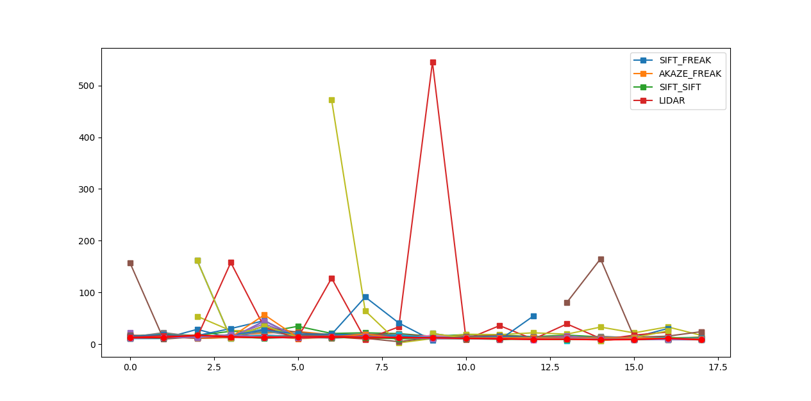
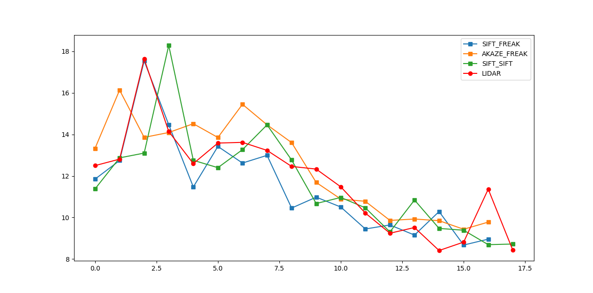

# SFND 3D Object Tracking

Welcome to the final project of the camera course. By completing all the lessons, you now have a solid understanding of keypoint detectors, descriptors, and methods to match them between successive images. Also, you know how to detect objects in an image using the YOLO deep-learning framework. And finally, you know how to associate regions in a camera image with Lidar points in 3D space. Let's take a look at our program schematic to see what we already have accomplished and what's still missing.


In this final project, you will implement the missing parts in the schematic. To do this, you will complete four major tasks: 
1. First, you will develop a way to match 3D objects over time by using keypoint correspondences. 
2. Second, you will compute the TTC based on Lidar measurements. 
3. You will then proceed to do the same using the camera, which requires to first associate keypoint matches to regions of interest and then to compute the TTC based on those matches. 
4. And lastly, you will conduct various tests with the framework. Your goal is to identify the most suitable detector/descriptor combination for TTC estimation and also to search for problems that can lead to faulty measurements by the camera or Lidar sensor. In the last course of this Nanodegree, you will learn about the Kalman filter, which is a great way to combine the two independent TTC measurements into an improved version which is much more reliable than a single sensor alone can be. But before we think about such things, let us focus on your final project in the camera course. 

## Common issue
```error: (-213:The function/feature is not implemented) Transpose the weights (except for convolutional) is not implemented in function 'ReadDarknetFromWeightsStream'```

Solution: the yolov3 weight file is not correct. Get the real one from yolo authors.
```
cd dat/yolo
wget "https://pjreddie.com/media/files/yolov3.weights"
```

## Dependencies for Running Locally
* cmake >= 2.8
  * All OSes: [click here for installation instructions](https://cmake.org/install/)
* make >= 4.1 (Linux, Mac), 3.81 (Windows)
  * Linux: make is installed by default on most Linux distros
  * Mac: [install Xcode command line tools to get make](https://developer.apple.com/xcode/features/)
  * Windows: [Click here for installation instructions](http://gnuwin32.sourceforge.net/packages/make.htm)
* Git LFS
  * Weight files are handled using [LFS](https://git-lfs.github.com/)
* OpenCV >= 4.1
  * This must be compiled from source using the `-D OPENCV_ENABLE_NONFREE=ON` cmake flag for testing the SIFT and SURF detectors.
  * The OpenCV 4.1.0 source code can be found [here](https://github.com/opencv/opencv/tree/4.1.0)
* gcc/g++ >= 5.4
  * Linux: gcc / g++ is installed by default on most Linux distros
  * Mac: same deal as make - [install Xcode command line tools](https://developer.apple.com/xcode/features/)
  * Windows: recommend using [MinGW](http://www.mingw.org/)

## Basic Build Instructions

1. Clone this repo.
2. Make a build directory in the top level project directory: `mkdir build && cd build`
3. Compile: `cmake .. && make`
4. Run it: `./3D_object_tracking`.

## Write up


### FP.1 Match 3D Objects
The matchBoundingBoxes method is implemented.

### FP.2 Compute Lidar-based TTC
The time-to-collision in seconds is implemented based on lidar points within the region of interest of each matched boundingbox.

### FP.3 Associate Keypoint Correspondences with Bounding Boxes
The keypoints in previous and current frame are matched and checked if they are within the ROI. Outliers are removed using a simple test with the average eucliean mean distance.

### FP.4 Compute Camera-based TTC
The time-to-collision in seconds is implemented using the relationship established between keypoint correspondences between previous and current frames.

### FP.5 Performance Evaluation 1
An example where the Lidar TTC estimate is inplausible is when lidar returns some points which are clearly not located on the vehicle, but much closer than that. It could be some dust particles in the air which introduce noise into the lidar scans. The result is a very low TTC.
To fix this, we can be more robust to the outliers by using an average distance instead of the closest point.

Another example of an inplausible Lidar TTC estimate, is where there are outliers due to the lidar scanning other parts of the vehicle in addition to its back surface. For example, the lidar is measuring the side mirrors, which appear much further away than the actual back of the car. In the experiment, the TTC increased from 12 to 16 seconds even though the minimum distance decreased from 7.79m to 7.68m. These points can be filtered out simply by increasing the shrink factor when clustering the lidar with ROI.

### FP.6 Performance Evaluation 2
All combinations of detector/descriptors were tested. In my experiments, the best performing camera TTC calculations used AKAZE detector and FREAK descriptor.

An example of an inplausible Camera TTC is if it came out to something much larger than 10 seconds. This is always due to bad keypoint matching, or the keypoint descriptor is not good enough to discriminate keypoints which are clustered together.

Below is a plot showing the Camera TTC compared to Lidar TTC.


The best performing ones are:

